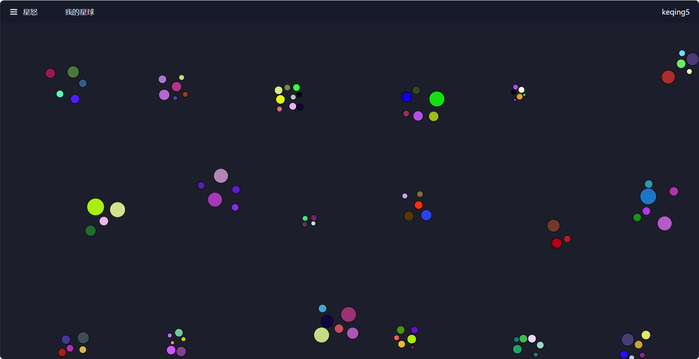
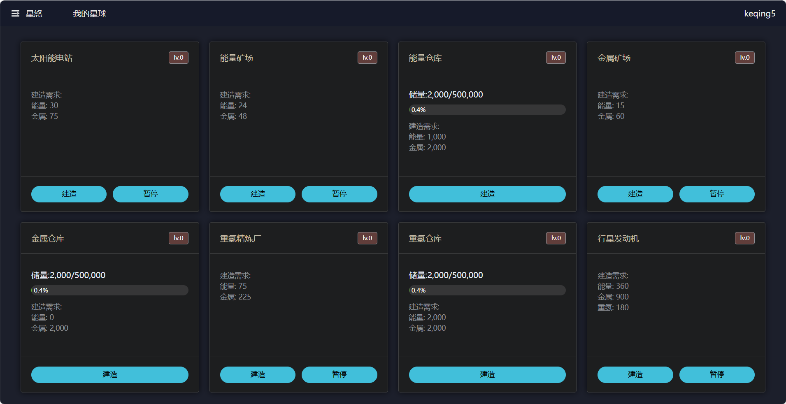

# 快速入门

注册账号后登录会进入到首页：

点击菜单中的“我的星球”：

## 我的星球

可以看到目前有八个建筑，分别是：

- 太阳能电站，用于生产电能，电能是生产型建筑工作的基础
- 金属矿场，消耗电能生成金属
- 金属仓库，用于存储金属
- 能量矿场，消耗电能生成能量
- 能量仓库，用于存储能量
- 重氢精炼厂，消耗电能生成重氢
- 重氢仓库，用于存储重氢
- 行星发动机，消耗电能和重氢，生产电能，未来可以移动星球

**建造顺序：**

1. 先建造*太阳能电站*，点击*太阳能电站*下方的“建造”按钮，有了电能才能让其他生产型的建筑工作
2. 再建造*金属矿场*、_能量矿场_、_重氢精炼厂_，生产金属、能量、重氢
